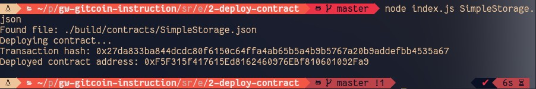

## Gitcoin: 2) Deploy A Simple Ethereum Smart Contract On Polyjuice
https://gitcoin.co/issue/nervosnetwork/grants/3/100026209

#### 1. A screenshot of the console output immediately after you have successfully deployed a smart contract.

#### 2. The transaction hash from the contract deployment (in text format).

0x27da833ba844dcdc80f6150c64ffa4ab65b5a4b9b5767a20b9addefbb4535a67

#### 3. The deployed contract address from the contract deployment (in text format).

0xF5F315f417615Ed8162460976EBf810601092Fa9