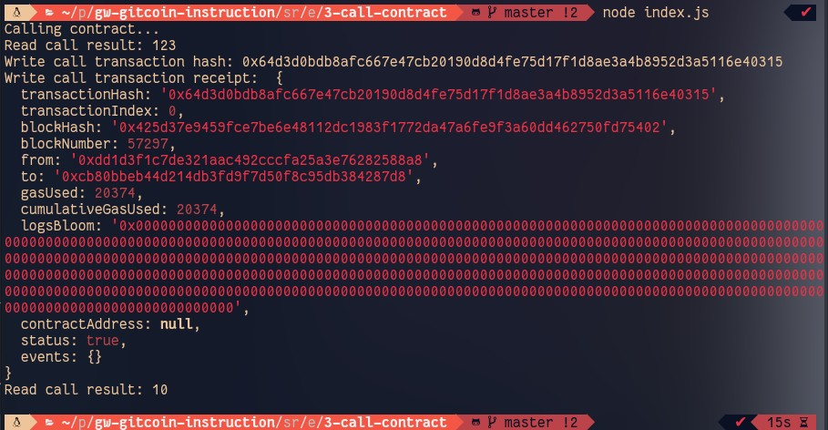

## Gitcoin: 3) Issue A Smart Contract Call To The Deployed Smart Contract
https://gitcoin.co/issue/nervosnetwork/grants/4/100026210

#### 1. A screenshot of the console output immediately after you have successfully issued a smart contract call.



#### 2. The transaction hash from the console output (in text format).

0x64d3d0bdb8afc667e47cb20190d8d4fe75d17f1d8ae3a4b8952d3a5116e40315

#### 3. The contract address that you called (in text format).

0xcb80BbEb44D214dB3Fd9f7d50F8C95dB384287d8

#### 4. The ABI for contract you made a call on (in text format).

```bash
"abi": [
    {
      "inputs": [],
      "stateMutability": "payable",
      "type": "constructor"
    },
    {
      "inputs": [
        {
          "internalType": "uint256",
          "name": "x",
          "type": "uint256"
        }
      ],
      "name": "set",
      "outputs": [],
      "stateMutability": "payable",
      "type": "function"
    },
    {
      "inputs": [],
      "name": "get",
      "outputs": [
        {
          "internalType": "uint256",
          "name": "",
          "type": "uint256"
        }
      ],
      "stateMutability": "view",
      "type": "function"
    }
  ],
  ```