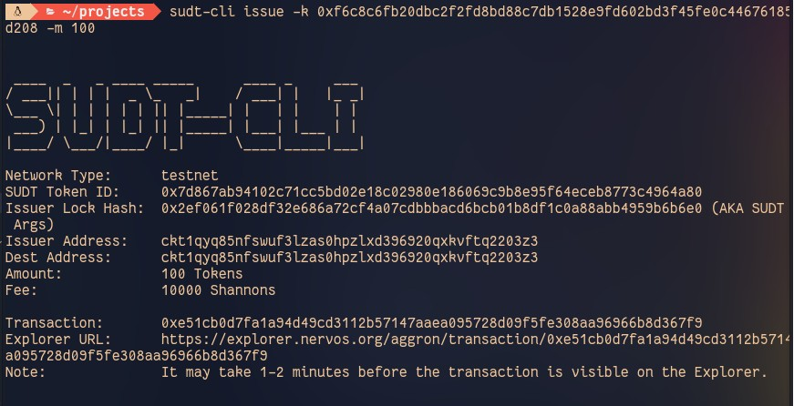
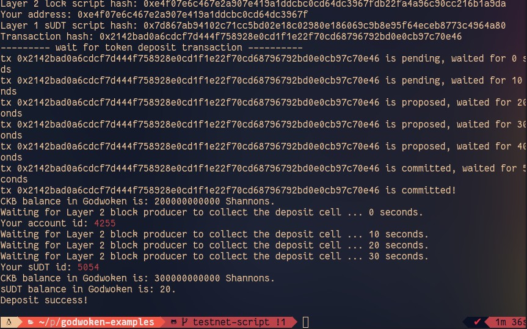

## Gitcoin: 4) Issue An SUDT Token On Layer 1 And Deposit It To Layer 2
https://gitcoin.co/issue/nervosnetwork/grants/5/100026211

#### 1. A link to the Layer 1 address you funded on the Testnet Explorer.

https://explorer.nervos.org/aggron/address/ckt1qyq85nfswuf3lzas0hpzlxd396920qxkvftq2203z3

#### 2. A screenshot of the console output immediately after using sudt-cli to create your SUDT tokens on Layer 1.

#### 3. A link to the transaction ID created by sudt-cli on the Testnet Explorer.

https://explorer.nervos.org/aggron/transaction/0x2142bad0a6cdcf7d444f758928e0cd1f1e22f70cd68796792bd0e0cb97c70e46

#### 4. A screenshot of the console output immediately after you have successfully submitted a deposit to Layer 2 using the account-cli tool.

#### 5. The SUDT ID from the console output after executing the deposit script (in text format).

Your sUDT id: 5054