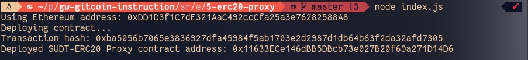
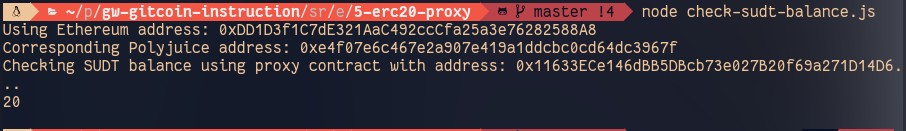

## Gitcoin: 5) Deploy The ERC20 Proxy Contract For The Deposited SUDT
https://gitcoin.co/issue/nervosnetwork/grants/6/100026212

#### 1. A screenshot of the console output immediately after deploying smart contract.

#### 2. The address of the ERC20 Proxy Contract you deployed (in text format).

0x11633ECe146dBB5DBcb73e027B20f69a271D14D6

#### 3. A screenshot of the console output immediately after checking your SUDT balance.

#### 4. The Ethereum address that was checked (in text format).

0xDD1D3f1C7dE321AaC492ccCfa25a3e76282588A8
