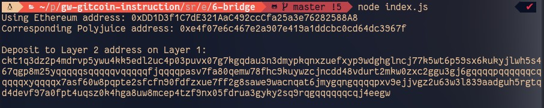

## Gitcoin: 6) Use Force Bridge To Deposit Tokens From Ethereum To Polyjuice
https://gitcoin.co/issue/nervosnetwork/grants/7/100026213

#### 1. A screenshot of the console output immediately after you have successfully generated your Deposit Receiver Address.

#### 2. Your Deposit Receiver Address (in text format).

ckt1qyq85nfswuf3lzas0hpzlxd396920qxkvftq2203z3

#### 3. The Ethereum address used to generate the Deposit Receiver Address (in text format).

0xDD1D3f1C7dE321AaC492ccCfa25a3e76282588A8

#### 4. A link to the Etherscan explorer for the successful Force Bridge transaction. This can be found on Force Bridge under History→Succeed.

https://rinkeby.etherscan.io/tx/0x6fd73875a4d171e3be94f7d0988138178aec25b2d73fcb38f1569d6abeb630ba

#### 5. A link to the Nervos explorer for the successful Force bridge transaction. This can be found on Force Bridge under History→Succeed.

https://explorer.nervos.org/aggron/transaction/0xddc1f7f00599552ac9b7697c0233c7fe5cb581a2160901e6df12a0a79caab43f